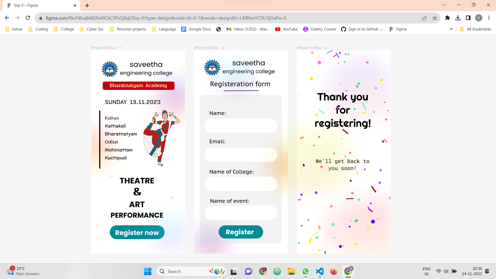

# Ex09 Event Registration Web Application
## Date:
14.11.2023

## AIM:
To design, develop and deploy a web application for event registration.

## DESIGN STEPS:

### Step 1:
Create a new frame.

### Step 2:
Select any one preset size of your choice.

### Step 3:
Select the shapes you need.

### Step 4:
Import images as needed.

### Step 5:
Create pages based on your need and link them.

### Step 6:

Validate the HTML and CSS code.

### Step 6:

Publish the website in the given URL.

## DESIGN TOOL:
Figma

## OUTPUT:
### Home Page
```
/* iPhone 14 Plus - 1 */

position: relative;
width: 428px;
height: 926px;

background: #FFFFFF;


/* Group 1 */

position: absolute;
width: 268px;
height: 63px;
left: 84px;
top: 797px;


/* Rectangle 1 */

position: absolute;
width: 249.7px;
height: 63px;
left: 84px;
top: 797px;

background: #048C95;
border-radius: 32px;


/* Register now */

position: absolute;
width: 243.24px;
height: 52px;
left: 108.76px;
top: 808px;

font-family: 'Poppins';
font-style: normal;
font-weight: 700;
font-size: 30px;
line-height: 45px;

color: #FFFFFF;


/* Group 2 */

position: absolute;
width: 375px;
height: 106px;
left: 27px;
top: 32px;


/* Rectangle 2 */

position: absolute;
width: 375px;
height: 106px;
left: 27px;
top: 32px;

background: #FFFFFF;
border-radius: 15px;


/* image 1 */

position: absolute;
width: 74px;
height: 71px;
left: 47px;
top: 50px;

background: url(image.png);


/* saveetha engineering college */

position: absolute;
width: 258px;
height: 72px;
left: 121px;
top: 40px;

font-family: 'Poppins';
font-style: normal;
font-weight: 400;
font-size: 32px;
line-height: 48px;
text-align: center;

color: #000000;


/* Untitled design (3) 1 */

position: absolute;
width: 217px;
height: 282px;
left: 225px;
top: 256px;

background: url(Untitled design (3).png);


/* Ellipse 1 */

position: absolute;
width: 167px;
height: 158px;
left: -69px;
top: 372px;

background: linear-gradient(180deg, rgba(255, 0, 31, 0.285) 0%, rgba(255, 246, 22, 0.275) 100%);
filter: blur(50px);


/* Star 7 */

position: absolute;
width: 19px;
height: 19px;
left: 356px;
top: 661px;

background: rgba(255, 221, 135, 0.5);
filter: blur(2px);


/* Ellipse 2 */

position: absolute;
width: 167px;
height: 161px;
left: 299px;
top: 138px;

background: linear-gradient(180deg, rgba(51, 0, 255, 0.27) 0%, rgba(255, 22, 22, 0.17) 100%);
filter: blur(50px);


/* Ellipse 3 */

position: absolute;
width: 167px;
height: 161px;
left: 282px;
top: 757px;

background: linear-gradient(180deg, rgba(0, 240, 255, 0.175) 0%, rgba(255, 115, 241, 0.28) 100%);
filter: blur(50px);


/* THEATRE & ART PERFORMANCE */

position: absolute;
width: 258px;
height: 192px;
left: 79px;
top: 575px;

font-family: 'Poppins';
font-style: normal;
font-weight: 700;
font-size: 36px;
line-height: 54px;
display: flex;
align-items: center;
text-align: center;

color: #000000;


/* Kathakali */

position: absolute;
width: 200px;
height: 60px;
left: 10px;
top: 315px;

font-family: 'Preahvihear';
font-style: normal;
font-weight: 400;
font-size: 20px;
line-height: 36px;
display: flex;
align-items: center;
text-align: center;

color: #000000;


/* Kathak */

position: absolute;
width: 134px;
height: 60px;
left: 27px;
top: 278px;

font-family: 'Poor Story';
font-style: normal;
font-weight: 400;
font-size: 24px;
line-height: 30px;
display: flex;
align-items: center;
text-align: center;

color: #000000;


/* Odissi */

position: absolute;
width: 134px;
height: 60px;
left: 25px;
top: 387px;

font-family: 'Poppins';
font-style: normal;
font-weight: 400;
font-size: 20px;
line-height: 30px;
display: flex;
align-items: center;
text-align: center;

color: #000000;


/* Rectangle 4 */

position: absolute;
width: 327px;
height: 38px;
left: 52px;
top: 142px;

background: #C70000;
border-radius: 8px;


/* Bharatnatyam Academy */

position: absolute;
width: 304px;
height: 31px;
left: 62px;
top: 144px;

font-family: 'Pridi';
font-style: normal;
font-weight: 400;
font-size: 24px;
line-height: 37px;
display: flex;
align-items: center;
text-align: center;

color: #FFFFFF;


/* Line 1 */

position: absolute;
width: 264px;
height: 0px;
left: 36px;
top: 274px;

border: 5px solid #000000;
transform: rotate(90deg);


/* Bharatnatyam */

position: absolute;
width: 200px;
height: 60px;
left: 35px;
top: 351px;

font-family: 'Preahvihear';
font-style: normal;
font-weight: 400;
font-size: 20px;
line-height: 36px;
display: flex;
align-items: center;
text-align: center;

color: #000000;


/* Mohiniattam */

position: absolute;
width: 200px;
height: 60px;
left: 25px;
top: 424px;

font-family: 'Preahvihear';
font-style: normal;
font-weight: 400;
font-size: 20px;
line-height: 36px;
display: flex;
align-items: center;
text-align: center;

color: #000000;


/* Kuchipudi */

position: absolute;
width: 200px;
height: 60px;
left: 12px;
top: 460px;

font-family: 'Preahvihear';
font-style: normal;
font-weight: 400;
font-size: 20px;
line-height: 36px;
display: flex;
align-items: center;
text-align: center;

color: #000000;


/* Star 1 */

position: absolute;
width: 19px;
height: 19px;
left: 25px;
top: 187px;

background: rgba(255, 221, 135, 0.5);
filter: blur(2px);


/* Star 2 */

position: absolute;
width: 19px;
height: 19px;
left: 79px;
top: 564px;

background: rgba(255, 221, 135, 0.5);
filter: blur(2px);


/* Star 3 */

position: absolute;
width: 19px;
height: 19px;
left: 356px;
top: 661px;

background: rgba(255, 221, 135, 0.5);
filter: blur(2px);


/* Star 6 */

position: absolute;
width: 19px;
height: 19px;
left: 18px;
top: 787px;

background: rgba(255, 221, 135, 0.5);
filter: blur(2px);


/* Star 5 */

position: absolute;
width: 19px;
height: 19px;
left: 342px;
top: 428px;

background: rgba(255, 221, 135, 0.5);
filter: blur(2px);


/* Star 4 */

position: absolute;
width: 19px;
height: 19px;
left: 402px;
top: 76px;

background: rgba(255, 221, 135, 0.5);
filter: blur(2px);


/* SUNDAY 19.11.2023 */

position: absolute;
width: 328px;
height: 85px;
left: 62px;
top: 217px;

font-family: 'Quantico';
font-style: normal;
font-weight: 400;
font-size: 25px;
line-height: 36px;

color: #000000;

```
### Registeration Form
```
/* iPhone 14 Plus - 2 */

position: relative;
width: 428px;
height: 926px;

background: #FFFFFF;


/* Rectangle 3 */

position: absolute;
width: 268px;
height: 288px;
left: -44px;
top: 461px;

border-radius: 27px;


/* Group 3 */

position: absolute;
width: 375px;
height: 106px;
left: 26px;
top: 25px;


/* Rectangle 2 */

position: absolute;
width: 375px;
height: 106px;
left: 26px;
top: 25px;

background: #FFFFFF;
border-radius: 15px;


/* image 1 */

position: absolute;
width: 74px;
height: 71px;
left: 46px;
top: 43px;

background: url(image.png);


/* saveetha engineering college */

position: absolute;
width: 258px;
height: 72px;
left: 120px;
top: 33px;

font-family: 'Poppins';
font-style: normal;
font-weight: 400;
font-size: 32px;
line-height: 48px;
text-align: center;

color: #000000;


/* Ellipse 4 */

position: absolute;
width: 167px;
height: 158px;
left: 327px;
top: 463px;

background: linear-gradient(180deg, rgba(255, 0, 31, 0.285) 0%, rgba(255, 246, 22, 0.275) 100%);
filter: blur(50px);


/* Ellipse 4 */

position: absolute;
width: 167px;
height: 161px;
left: 106px;
top: 51px;

background: linear-gradient(180deg, rgba(0, 240, 255, 0.175) 0%, rgba(255, 115, 241, 0.28) 100%);
filter: blur(50px);


/* Ellipse 4 */

position: absolute;
width: 167px;
height: 161px;
left: -11px;
top: 811px;

background: linear-gradient(180deg, rgba(51, 0, 255, 0.27) 0%, rgba(255, 22, 22, 0.17) 100%);
filter: blur(50px);


/* Registeration form */

position: absolute;
width: 317px;
height: 52px;
left: 73px;
top: 132px;

font-family: 'PT Sans Caption';
font-style: normal;
font-weight: 400;
font-size: 30px;
line-height: 39px;

color: #000000;


/* Rectangle 5 */

position: absolute;
width: 375px;
height: 675px;
left: 26px;
top: 204px;

background: rgba(217, 217, 217, 0.32);
border-radius: 20px;


/* Line 2 */

position: absolute;
width: 157px;
height: 0px;
left: 136px;
top: 184.03px;

border: 2px solid #000000;
transform: rotate(-0.37deg);


/* Rectangle 6 */

position: absolute;
width: 330px;
height: 65px;
left: 49px;
top: 310px;

background: #FFFFFF;
border-radius: 34px;


/* Rectangle 10 */

position: absolute;
width: 203px;
height: 60px;
left: 112px;
top: 797px;

background: #048C95;
border-radius: 34px;


/* Rectangle 7 */

position: absolute;
width: 330px;
height: 65px;
left: 49px;
top: 443px;

background: #FFFFFF;
border-radius: 34px;


/* Rectangle 8 */

position: absolute;
width: 330px;
height: 65px;
left: 49px;
top: 575px;

background: #FFFFFF;
border-radius: 34px;


/* Rectangle 9 */

position: absolute;
width: 330px;
height: 65px;
left: 49px;
top: 708px;

background: #FFFFFF;
border-radius: 34px;


/* Name: */

position: absolute;
width: 239px;
height: 35px;
left: 70px;
top: 270px;

font-family: 'PT Sans Caption';
font-style: normal;
font-weight: 400;
font-size: 24px;
line-height: 31px;

color: #000000;


/* Name of College: */

position: absolute;
width: 239px;
height: 38px;
left: 70px;
top: 537px;

font-family: 'PT Sans Caption';
font-style: normal;
font-weight: 400;
font-size: 24px;
line-height: 31px;

color: #000000;


/* Name of event: */

position: absolute;
width: 239px;
height: 38px;
left: 73px;
top: 670px;

font-family: 'PT Sans Caption';
font-style: normal;
font-weight: 400;
font-size: 24px;
line-height: 31px;

color: #000000;


/* Email: */

position: absolute;
width: 239px;
height: 38px;
left: 70px;
top: 399px;

font-family: 'PT Sans Caption';
font-style: normal;
font-weight: 400;
font-size: 24px;
line-height: 31px;

color: #000000;


/* Register */

position: absolute;
width: 137px;
height: 52px;
left: 145px;
top: 805px;

font-family: 'Poppins';
font-style: normal;
font-weight: 700;
font-size: 30px;
line-height: 45px;

color: #FFFFFF;

```
### Post Registeration Form
```
/* iPhone 14 Plus - 3 */

position: relative;
width: 428px;
height: 926px;

background: #FFFFFF;


/* Ellipse 4 */

position: absolute;
width: 312px;
height: 288px;
left: 138px;
top: 38px;

background: linear-gradient(180deg, rgba(51, 0, 255, 0.108) 0%, rgba(255, 22, 22, 0.068) 100%);
filter: blur(50px);


/* Ellipse 5 */

position: absolute;
width: 340px;
height: 311px;
left: 124px;
top: 672px;

background: linear-gradient(180deg, rgba(255, 0, 31, 0.114) 30.25%, rgba(255, 246, 22, 0.11) 130.25%);
filter: blur(50px);


/* Thank you for registering! */

position: absolute;
width: 298px;
height: 117px;
left: 61px;
top: 181px;

font-family: 'Righteous';
font-style: normal;
font-weight: 400;
font-size: 48px;
line-height: 60px;
text-align: center;

color: #000000;


/* We’ll get back to you soon! */

position: absolute;
width: 281px;
height: 126px;
left: 68px;
top: 488px;

font-family: 'Roboto Mono';
font-style: normal;
font-weight: 400;
font-size: 24px;
line-height: 32px;
text-align: center;

color: #000000;


/* Rectangle */

position: absolute;
width: 10.48px;
height: 5.28px;
left: 261px;
top: 778px;

background: rgba(43, 0, 255, 0.35);
transform: rotate(-11deg);


/* Rectangle */

position: absolute;
width: 11.48px;
height: 5.28px;
left: 97px;
top: 914px;

background: #FFEA00;
transform: rotate(-54deg);


/* Rectangle */

position: absolute;
width: 33.48px;
height: 6.28px;
left: 103px;
top: 267px;

background: rgba(0, 255, 98, 0.45);
transform: rotate(36deg);


/* Rectangle */

position: absolute;
width: 23.48px;
height: 7.28px;
left: 329px;
top: 718px;

background: rgba(138, 0, 0, 0.65);
transform: rotate(38deg);


/* Rectangle */

position: absolute;
width: 31.48px;
height: 5.28px;
left: 136px;
top: 10px;

background: rgba(43, 0, 255, 0.35);
transform: rotate(-24deg);


/* Rectangle */

position: absolute;
width: 12.48px;
height: 7.28px;
left: 30px;
top: 530px;

background: #2B00FF;
transform: rotate(-106deg);


/* Rectangle */

position: absolute;
width: 27.48px;
height: 4.28px;
left: 180px;
top: 9px;

background: rgba(43, 0, 255, 0.65);
transform: rotate(58deg);


/* Rectangle */

position: absolute;
width: 31.48px;
height: 5.28px;
left: 69px;
top: 840px;

background: rgba(255, 234, 0, 0.45);
transform: rotate(-31deg);


/* Rectangle */

position: absolute;
width: 33.48px;
height: 4.28px;
left: 225px;
top: 674px;

background: rgba(138, 0, 0, 0.9);
transform: rotate(-2deg);


/* Rectangle */

position: absolute;
width: 17.48px;
height: 4.28px;
left: 164px;
top: 28px;

background: rgba(138, 0, 0, 0.6);
transform: rotate(-32deg);


/* Rectangle */

position: absolute;
width: 25.48px;
height: 6.28px;
left: 131px;
top: 914px;

background: rgba(43, 0, 255, 0.6);
transform: rotate(73deg);


/* Rectangle */

position: absolute;
width: 14.48px;
height: 8.28px;
left: 4px;
top: 677px;

background: rgba(254, 32, 246, 0.6);
transform: rotate(-13deg);


/* Rectangle */

position: absolute;
width: 34.48px;
height: 6.28px;
left: 358px;
top: 648px;

background: rgba(138, 0, 0, 0.9);
transform: rotate(-126deg);


/* Rectangle */

position: absolute;
width: 32.48px;
height: 7.28px;
left: 232px;
top: 383px;

background: rgba(138, 0, 0, 0.75);
transform: rotate(-141deg);


/* Rectangle */

position: absolute;
width: 18.48px;
height: 7.28px;
left: 13px;
top: 397px;

background: rgba(255, 114, 114, 0.85);
transform: rotate(-16deg);


/* Rectangle */

position: absolute;
width: 20.48px;
height: 8.28px;
left: 408px;
top: 423px;

background: rgba(255, 114, 114, 0.6);
transform: rotate(-128deg);


/* Rectangle */

position: absolute;
width: 12.48px;
height: 7.28px;
left: 327px;
top: 710px;

background: rgba(254, 32, 246, 0.75);
transform: rotate(56deg);


/* Rectangle */

position: absolute;
width: 35.48px;
height: 4.28px;
left: 302px;
top: 238px;

background: rgba(0, 255, 98, 0.75);
transform: rotate(64deg);


/* Rectangle */

position: absolute;
width: 25.48px;
height: 8.28px;
left: 69px;
top: 855px;

background: rgba(255, 234, 0, 0.75);
transform: rotate(104deg);


/* Rectangle */

position: absolute;
width: 11.48px;
height: 4.28px;
left: 232px;
top: 185px;

background: rgba(254, 32, 246, 0.6);
transform: rotate(176deg);


/* Rectangle */

position: absolute;
width: 15.48px;
height: 5.28px;
left: 271px;
top: 565px;

background: rgba(255, 234, 0, 0.9);
transform: rotate(-77deg);


/* Rectangle */

position: absolute;
width: 11.48px;
height: 7.28px;
left: 372px;
top: 606px;

background: rgba(43, 0, 255, 0.6);
transform: rotate(-60deg);


/* Rectangle */

position: absolute;
width: 10.48px;
height: 7.28px;
left: 58px;
top: 770px;

background: rgba(138, 0, 0, 0.35);
transform: rotate(112deg);


/* Ellipse */

position: absolute;
width: 12.63px;
height: 12.63px;
left: 82px;
top: 642px;

background: rgba(43, 0, 255, 0.65);


/* Ellipse */

position: absolute;
width: 11.63px;
height: 11.63px;
left: 346px;
top: 274px;

background: rgba(0, 255, 98, 0.45);


/* Ellipse */

position: absolute;
width: 10.63px;
height: 10.63px;
left: 277px;
top: 146px;

background: rgba(0, 255, 98, 0.9);


/* Ellipse */

position: absolute;
width: 11.63px;
height: 11.63px;
left: 65px;
top: 4px;

background: rgba(255, 114, 114, 0.6);


/* Ellipse */

position: absolute;
width: 14.63px;
height: 14.63px;
left: 418px;
top: 665px;

background: rgba(255, 114, 114, 0.45);


/* Ellipse */

position: absolute;
width: 11.63px;
height: 11.63px;
left: 97px;
top: 798px;

background: rgba(255, 114, 114, 0.65);


/* Ellipse */

position: absolute;
width: 11.63px;
height: 11.63px;
left: 216px;
top: 11px;

background: rgba(254, 32, 246, 0.35);


/* Ellipse */

position: absolute;
width: 11.63px;
height: 11.63px;
left: 316px;
top: 49px;

background: rgba(255, 114, 114, 0.9);


/* Ellipse */

position: absolute;
width: 11.63px;
height: 11.63px;
left: 107px;
top: 524px;

background: rgba(254, 32, 246, 0.75);


/* Ellipse */

position: absolute;
width: 8.63px;
height: 8.63px;
left: 75px;
top: 429px;

background: rgba(138, 0, 0, 0.35);


/* Ellipse */

position: absolute;
width: 5.63px;
height: 5.63px;
left: 393px;
top: 417px;

background: rgba(0, 255, 98, 0.85);


/* Ellipse */

position: absolute;
width: 12.63px;
height: 12.63px;
left: 381px;
top: 128px;

background: #FFEA00;


/* Ellipse */

position: absolute;
width: 11.63px;
height: 11.63px;
left: 262px;
top: 877px;

background: rgba(255, 234, 0, 0.85);


/* Ellipse */

position: absolute;
width: 5.63px;
height: 5.63px;
left: 218px;
top: 479px;

background: rgba(138, 0, 0, 0.65);


/* Ellipse */

position: absolute;
width: 9.63px;
height: 9.63px;
left: 302px;
top: 279px;

background: #FFEA00;


/* Ellipse */

position: absolute;
width: 7.63px;
height: 7.63px;
left: 264px;
top: 238px;

background: rgba(255, 234, 0, 0.35);


/* Ellipse */

position: absolute;
width: 13.63px;
height: 13.63px;
left: 266px;
top: 768px;

background: rgba(0, 255, 98, 0.9);


/* Ellipse */

position: absolute;
width: 7.63px;
height: 7.63px;
left: 237px;
top: 799px;

background: #2B00FF;


/* Ellipse */

position: absolute;
width: 10.63px;
height: 10.63px;
left: 181px;
top: 258px;

background: rgba(254, 32, 246, 0.85);


/* Ellipse */

position: absolute;
width: 4.63px;
height: 4.63px;
left: 246px;
top: 774px;

background: rgba(138, 0, 0, 0.35);


/* Ellipse */

position: absolute;
width: 9.63px;
height: 9.63px;
left: 356px;
top: 167px;

background: rgba(255, 114, 114, 0.75);


/* Ellipse */

position: absolute;
width: 10.63px;
height: 10.63px;
left: 402px;
top: 309px;

background: rgba(255, 114, 114, 0.9);


/* Ellipse */

position: absolute;
width: 5.63px;
height: 5.63px;
left: 366px;
top: 766px;

background: rgba(255, 114, 114, 0.9);


/* Polygon */

position: absolute;
width: 12.26px;
height: 12.26px;
left: 97px;
top: 387px;

background: rgba(254, 32, 246, 0.85);
transform: rotate(8deg);


/* Polygon */

position: absolute;
width: 11.26px;
height: 11.26px;
left: 266px;
top: 275px;

background: rgba(0, 255, 98, 0.85);
transform: rotate(-155deg);


/* Polygon */

position: absolute;
width: 16.26px;
height: 16.26px;
left: 107px;
top: 34px;

background: rgba(255, 234, 0, 0.35);
transform: rotate(-172deg);


/* Polygon */

position: absolute;
width: 11.26px;
height: 11.26px;
left: 422px;
top: 268px;

background: rgba(255, 114, 114, 0.9);
transform: rotate(84deg);


/* Polygon */

position: absolute;
width: 16.26px;
height: 16.26px;
left: 196px;
top: 882px;

background: rgba(43, 0, 255, 0.85);
transform: rotate(30deg);


/* Polygon */

position: absolute;
width: 15.26px;
height: 15.26px;
left: 80px;
top: 290px;

background: rgba(255, 234, 0, 0.85);
transform: rotate(-29deg);


/* Polygon */

position: absolute;
width: 11.26px;
height: 11.26px;
left: 318px;
top: 542px;

background: rgba(254, 32, 246, 0.75);
transform: rotate(132deg);


/* Polygon */

position: absolute;
width: 12.26px;
height: 12.26px;
left: 279px;
top: 687px;

background: rgba(0, 255, 98, 0.65);
transform: rotate(-102deg);


/* Polygon */

position: absolute;
width: 18.26px;
height: 18.26px;
left: 61px;
top: 117px;

background: rgba(255, 234, 0, 0.9);
transform: rotate(17deg);


/* Polygon */

position: absolute;
width: 10.26px;
height: 10.26px;
left: 191px;
top: 7px;

background: rgba(138, 0, 0, 0.6);
transform: rotate(-3deg);


/* Polygon */

position: absolute;
width: 16.26px;
height: 16.26px;
left: 163px;
top: 782px;

background: rgba(0, 255, 98, 0.6);
transform: rotate(35deg);


/* Polygon */

position: absolute;
width: 16.26px;
height: 16.26px;
left: 424px;
top: 110px;

background: rgba(0, 255, 98, 0.75);
transform: rotate(-41deg);


/* Polygon */

position: absolute;
width: 18.26px;
height: 18.26px;
left: 108px;
top: 67px;

background: rgba(254, 32, 246, 0.6);
transform: rotate(-159deg);


/* Polygon */

position: absolute;
width: 16.26px;
height: 16.26px;
left: 259px;
top: 640px;

background: rgba(138, 0, 0, 0.35);
transform: rotate(76deg);


/* Polygon */

position: absolute;
width: 19.26px;
height: 19.26px;
left: 341px;
top: 792px;

background: rgba(43, 0, 255, 0.9);
transform: rotate(-108deg);


/* Polygon */

position: absolute;
width: 14.26px;
height: 14.26px;
left: 166px;
top: 715px;

background: rgba(255, 114, 114, 0.65);
transform: rotate(166deg);


/* Polygon */

position: absolute;
width: 13.26px;
height: 13.26px;
left: 227px;
top: 23px;

background: rgba(0, 255, 98, 0.9);
transform: rotate(-79deg);


/* Polygon */

position: absolute;
width: 11.26px;
height: 11.26px;
left: 213px;
top: 331px;

background: rgba(255, 234, 0, 0.65);
transform: rotate(-160deg);


/* Polygon */

position: absolute;
width: 9.26px;
height: 9.26px;
left: 26px;
top: 542px;

background: rgba(255, 114, 114, 0.45);
transform: rotate(107deg);


/* Polygon */

position: absolute;
width: 10.26px;
height: 10.26px;
left: 339px;
top: 690px;

background: rgba(43, 0, 255, 0.75);
transform: rotate(60deg);


/* Polygon */

position: absolute;
width: 9.26px;
height: 9.26px;
left: 174px;
top: 847px;

background: rgba(0, 255, 98, 0.9);
transform: rotate(72deg);


/* Polygon */

position: absolute;
width: 12.26px;
height: 12.26px;
left: 109px;
top: 819px;

background: rgba(0, 255, 98, 0.45);
transform: rotate(180deg);


/* Polygon */

position: absolute;
width: 17.26px;
height: 17.26px;
left: 265px;
top: 171px;

background: rgba(138, 0, 0, 0.45);
transform: rotate(-81deg);


/* Star */

position: absolute;
width: 9.26px;
height: 9.26px;
left: 195px;
top: 145px;

background: rgba(255, 114, 114, 0.6);
transform: rotate(23deg);


/* Star */

position: absolute;
width: 15.26px;
height: 15.26px;
left: 313px;
top: 242px;

background: rgba(0, 255, 98, 0.35);
transform: rotate(-104deg);


/* Star */

position: absolute;
width: 17.26px;
height: 17.26px;
left: 182px;
top: 472px;

background: rgba(138, 0, 0, 0.35);
transform: rotate(147deg);


/* Star */

position: absolute;
width: 15.26px;
height: 15.26px;
left: 11px;
top: 654px;

background: rgba(43, 0, 255, 0.9);
transform: rotate(-27deg);


/* Star */

position: absolute;
width: 10.26px;
height: 10.26px;
left: 5px;
top: 290px;

background: rgba(255, 234, 0, 0.35);
transform: rotate(16deg);


/* Star */

position: absolute;
width: 16.26px;
height: 16.26px;
left: 371px;
top: 543px;

background: rgba(43, 0, 255, 0.6);
transform: rotate(-29deg);


/* Star */

position: absolute;
width: 14.26px;
height: 14.26px;
left: 374px;
top: 301px;

background: rgba(255, 234, 0, 0.35);
transform: rotate(-74deg);


/* Star */

position: absolute;
width: 9.26px;
height: 9.26px;
left: 22px;
top: 88px;

background: rgba(255, 234, 0, 0.45);
transform: rotate(-63deg);


/* Star */

position: absolute;
width: 13.26px;
height: 13.26px;
left: 19px;
top: 880px;

background: #00FF62;
transform: rotate(152deg);


/* Star */

position: absolute;
width: 16.26px;
height: 16.26px;
left: 404px;
top: 416px;

background: rgba(138, 0, 0, 0.9);
transform: rotate(143deg);


/* Star */

position: absolute;
width: 10.26px;
height: 10.26px;
left: 239px;
top: 503px;

background: rgba(0, 255, 98, 0.65);
transform: rotate(-108deg);


/* Star */

position: absolute;
width: 10.26px;
height: 10.26px;
left: 428px;
top: 568px;

background: rgba(254, 32, 246, 0.75);
transform: rotate(-11deg);


/* Star */

position: absolute;
width: 9.26px;
height: 9.26px;
left: 218px;
top: 891px;

background: rgba(255, 114, 114, 0.75);
transform: rotate(150deg);


/* Star */

position: absolute;
width: 15.26px;
height: 15.26px;
left: 241px;
top: 477px;

background: rgba(254, 32, 246, 0.9);
transform: rotate(-127deg);


/* Star */

position: absolute;
width: 12.26px;
height: 12.26px;
left: 400px;
top: 245px;

background: #FF7272;
transform: rotate(-127deg);


/* Star */

position: absolute;
width: 18.26px;
height: 18.26px;
left: 84px;
top: 863px;

background: rgba(0, 255, 98, 0.9);
transform: rotate(-96deg);


/* Star */

position: absolute;
width: 14.26px;
height: 14.26px;
left: 213px;
top: 44px;

background: rgba(0, 255, 98, 0.85);
transform: rotate(9deg);


/* Star */

position: absolute;
width: 11.26px;
height: 11.26px;
left: 12px;
top: 209px;

background: rgba(0, 255, 98, 0.35);
transform: rotate(-152deg);


/* Star */

position: absolute;
width: 13.26px;
height: 13.26px;
left: 13px;
top: 799px;

background: rgba(138, 0, 0, 0.6);
transform: rotate(-47deg);


/* Star */

position: absolute;
width: 14.26px;
height: 14.26px;
left: 245px;
top: 584px;

background: #8A0000;
transform: rotate(39deg);


/* Star */

position: absolute;
width: 9.26px;
height: 9.26px;
left: 191px;
top: 65px;

background: rgba(255, 114, 114, 0.85);
transform: rotate(-146deg);


/* Star */

position: absolute;
width: 10.26px;
height: 10.26px;
left: 201px;
top: 396px;

background: rgba(255, 114, 114, 0.65);
transform: rotate(15deg);


/* Star */

position: absolute;
width: 18.26px;
height: 18.26px;
left: 324px;
top: 801px;

background: rgba(255, 234, 0, 0.9);
transform: rotate(38deg);

```

## OUTPUT:


## RESULT:
The program to design, develop and deploy a web application for event registration is completed successfully.
